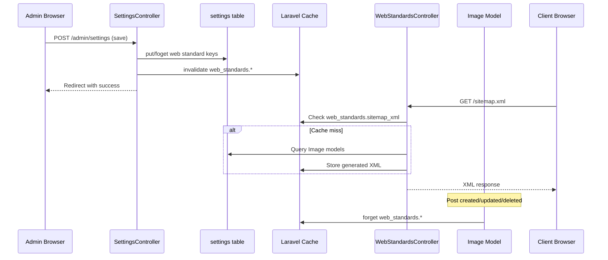
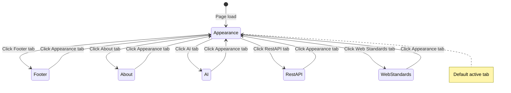

# Admin Settings Tabs & Web Standards — Implementation Plan

## Overview

Refactor the monolithic admin settings page into a **tabbed interface** with 6 tabs, and add new **Web Standards** capabilities (dynamic `robots.txt`, `llms.txt`, `llms-full.txt`, `sitemap.xml` with auto-regeneration).

### Tabs

| # | Tab | Existing Fields |
|---|-----|----------------|
| 1 | **Appearance** | Logo, Favicon, Default theme, Default locale, Posts per page, Feed posts count, Post path prefix, Hide title section, Hide filter label, Site title/subtitle per locale |
| 2 | **Footer** | Footer text per locale, Footer HTML per locale |
| 3 | **About** | About page content per locale |
| 4 | **Artificial Intelligence** | AI Generate Prompt |
| 5 | **RestAPI** | API Token |
| 6 | **Web Standards** (NEW) | robots.txt enable + content, llms.txt enable, llms-full.txt enable, sitemap.xml enable |

### Architecture decision: Dynamic routes vs static files

Web standards files are served via **dynamic Laravel routes** with **cache-based generation**. When posts change (create/update/delete), the relevant caches are invalidated. This avoids filesystem complexity and works with containerized deployments.

---

## Step 1 — Tabbed UI in [`resources/views/admin/settings.blade.php`](resources/views/admin/settings.blade.php)

**Replace** the single `<form>` with a tabbed layout:

```
┌─────────────────────────────────────────────────┐
│ [Appearance] [Footer] [About] [AI] [RestAPI] [Web Standards] │
├─────────────────────────────────────────────────┤
│                                                 │
│  (active tab content goes here)                 │
│                                                 │
│  [Save settings]                                │
│                                                 │
└─────────────────────────────────────────────────┘
```

**Implementation details:**

- A single `<form>` wrapping all tabs (same `POST /admin/settings` endpoint).
- Tab buttons use `<button type="button">` styled as pills with Tailwind: inactive tabs have `bg-transparent border-card-border text-muted`, active tab has `bg-accent border-accent text-white`.
- Each tab's content is a `<div>` with `class="tab-panel"` and a `data-tab="tabname"` attribute.
- JavaScript at the bottom handles toggling: hides all `.tab-panel`, shows the selected one, updates button styles.
- The first tab ("Appearance") is shown by default. The active tab is persisted in `sessionStorage` so it is remembered when navigating away and back. On initial visit with no stored value, "Appearance" is selected.
- On form submit validation error, the last-active tab is read from `sessionStorage` and restored. Additionally, the first tab containing a validation error is auto-selected to make errors visible.
- On form submit, all fields from all tabs are submitted — only the visible one matters to the user.

**Key CSS/JS pattern for tabs:**

```html
<!-- Tab buttons -->
<div class="flex flex-wrap gap-2 mb-6 border-b border-card-border pb-3" role="tablist">
    <button type="button" class="tab-btn active px-4 py-2 rounded-t text-sm font-medium" data-tab="appearance" role="tab" aria-selected="true">
        {{ __('messages.settings_tab_appearance') }}
    </button>
    <!-- ... more tabs ... -->
</div>

<!-- Tab panels -->
<div class="tab-panel" data-tab="appearance" role="tabpanel">
    <!-- Appearance fields -->
</div>
<div class="tab-panel hidden" data-tab="footer" role="tabpanel">
    <!-- Footer fields -->
</div>
```

JS: querySelectorAll on `.tab-btn`, add click listeners that deactivate all, activate clicked, show/hide corresponding `.tab-panel`.

**Field-to-tab mapping (existing fields):**

| Existing Field | Moves to Tab |
|---|---|
| Logo | Appearance |
| Favicon | Appearance |
| Default theme | Appearance |
| Default locale | Appearance |
| Posts per page | Appearance |
| Feed posts count | Appearance |
| Post path prefix | Appearance |
| Hide title section | Appearance |
| Hide filter label | Appearance |
| Site title/subtitle per locale | Appearance |
| Footer text per locale | Footer |
| Footer HTML per locale | Footer |
| About page content per locale | About |
| AI Generate Prompt | Artificial Intelligence |
| API Token | RestAPI |

---

## Step 2 — New Web Standards settings fields

Add to the **Web Standards** tab panel:

### robots.txt
- Toggle checkbox: `robots_enabled` (default: on/checked, since the static file currently exists)
- Textarea: `robots_content` — pre-filled with the current content from [`public/robots.txt`](public/robots.txt):
  ```
  User-agent: *
  Disallow: /admin
  Disallow: /auth
  ```
- Help text explaining this will be served at `/robots.txt`

### llms.txt
- Toggle checkbox: `llms_enabled`
- Help text: "Provides a machine-readable list of all posts with descriptions at `/llms.txt`. Auto-regenerated when posts change."

### llms-full.txt
- Toggle checkbox: `llms_full_enabled`
- Help text: "Provides full post content at `/llms-full.txt`. Auto-regenerated when posts change."

### sitemap.xml
- Toggle checkbox: `sitemap_enabled`
- Help text: "Provides an XML sitemap at `/sitemap.xml`. Auto-regenerated when posts change."

### Setting keys used (stored in `settings` table):

| Key | Type | Default |
|-----|------|---------|
| `robots_enabled` | `'1'` / absent | `'1'` (enabled) |
| `robots_content` | text | `"User-agent: *\nDisallow: /admin\nDisallow: /auth"` |
| `llms_enabled` | `'1'` / absent | absent (disabled) |
| `llms_full_enabled` | `'1'` / absent | absent (disabled) |
| `sitemap_enabled` | `'1'` / absent | absent (disabled) |

---

## Step 3 — Update [`SettingsController@edit`](app/Http/Controllers/Admin/SettingsController.php)

Add these to the `edit()` method's view data array:

```php
'robotsEnabled'     => (bool) Setting::get('robots_enabled', true),
'robotsContent'     => Setting::get('robots_content', "User-agent: *\nDisallow: /admin\nDisallow: /auth"),
'llmsEnabled'       => (bool) Setting::get('llms_enabled'),
'llmsFullEnabled'   => (bool) Setting::get('llms_full_enabled'),
'sitemapEnabled'    => (bool) Setting::get('sitemap_enabled'),
```

Note: `robotsEnabled` defaults to `true` since the site currently has a static robots.txt.

---

## Step 4 — Update [`SettingsController@update`](app/Http/Controllers/Admin/SettingsController.php)

Add validation rules inside the existing `$validated` array:

```php
'robots_enabled'       => ['nullable', 'boolean'],
'robots_content'       => ['nullable', 'string', 'max:5000'],
'llms_enabled'         => ['nullable', 'boolean'],
'llms_full_enabled'    => ['nullable', 'boolean'],
'sitemap_enabled'      => ['nullable', 'boolean'],
```

Add persistence logic (following the existing boolean pattern used for `hide_title_section`):

```php
// robots.txt
if ($request->has('robots_enabled') && $request->input('robots_enabled') === '1') {
    Setting::put('robots_enabled', '1');
} else {
    Setting::forget('robots_enabled');
}
$robotsContent = trim((string) ($request->input('robots_content', '')));
if ($robotsContent !== '') {
    Setting::put('robots_content', $robotsContent);
} else {
    Setting::forget('robots_content');
}

// llms.txt
if ($request->has('llms_enabled') && $request->input('llms_enabled') === '1') {
    Setting::put('llms_enabled', '1');
} else {
    Setting::forget('llms_enabled');
}

// llms-full.txt
if ($request->has('llms_full_enabled') && $request->input('llms_full_enabled') === '1') {
    Setting::put('llms_full_enabled', '1');
} else {
    Setting::forget('llms_full_enabled');
}

// sitemap.xml
if ($request->has('sitemap_enabled') && $request->input('sitemap_enabled') === '1') {
    Setting::put('sitemap_enabled', '1');
} else {
    Setting::forget('sitemap_enabled');
}
```

When any web standards setting changes, invalidate related caches:

```php
Cache::forget('web_standards.llms_txt');
Cache::forget('web_standards.llms_full_txt');
Cache::forget('web_standards.sitemap_xml');
```

---

## Step 5 — Create [`app/Http/Controllers/WebStandardsController.php`](app/Http/Controllers/WebStandardsController.php)

A new invocable-style controller (or single controller with multiple methods) that serves the dynamic files.

### Routes to register in [`routes/web.php`](routes/web.php):

```php
use App\Http\Controllers\WebStandardsController;

Route::get('/robots.txt', [WebStandardsController::class, 'robots']);
Route::get('/llms.txt', [WebStandardsController::class, 'llms']);
Route::get('/llms-full.txt', [WebStandardsController::class, 'llmsFull']);
Route::get('/sitemap.xml', [WebStandardsController::class, 'sitemap']);
```

These MUST be registered **before** any catch-all routes. They should be placed near the top of `routes/web.php`, after the `use` statements but before the `Route::get('/', ...)` line. The existing static `public/robots.txt` will be overshadowed by the Laravel route.

### `robots()` method:
- Check `robots_enabled` setting (default: true)
- If disabled, return 404
- If enabled, return `Setting::get('robots_content', "User-agent: *\nDisallow: /admin\nDisallow: /auth")` with `Content-Type: text/plain`
- Cache the response for 1 hour (`Cache::remember`)

### `llms()` method:
- Check `llms_enabled` setting
- If disabled, return 404
- Generate content: list all posts (newest first) with content from ALL supported locales:
  - For each post, iterate over all locales and include content if the post has a headline or description in that locale
  - Title (headline or description excerpt, localized)
  - URL: `route('image.show', ['uuid' => $image->uuid])`
  - Locale label before each entry (e.g. `[en-US]`, `[pt-BR]`)
  - Format: Markdown-style list with `- [title](url) [locale]: description`
- Cache with key `web_standards.llms_txt` for 1 hour
- Return `Content-Type: text/plain; charset=utf-8`

### `llmsFull()` method:
- Check `llms_full_enabled` setting
- If disabled, return 404
- Generate content: full markdown for each post including content from ALL supported locales:
  - Group by post, then list each locale's content under it
  - `## Title [locale]`
  - URL
  - Full description (localized)
  - Categories and tags
  - Separator between posts (`---`), with locale sections within each post
- Cache with key `web_standards.llms_full_txt` for 1 hour
- Return `Content-Type: text/plain; charset=utf-8`

### `sitemap()` method:
- Check `sitemap_enabled` setting
- If disabled, return 404
- Generate XML sitemap using `DOMDocument`:
  - Root `<urlset>` with `xmlns="http://www.sitemaps.org/schemas/sitemap/0.9"`
  - `<url>` entry for homepage (`/`)
  - `<url>` entry for about page (`/about`)
  - `<url>` entry for each post (`/p/{uuid}`) with `<lastmod>` from `updated_at`
- Cache with key `web_standards.sitemap_xml` for 1 hour
- Return `Content-Type: application/xml; charset=utf-8`

---

## Step 6 — Auto-invalidation on post changes

Add to [`app/Models/Image.php`](app/Models/Image.php) in the `booted()` method:

```php
use Illuminate\Support\Facades\Cache;

static::created(function (Image $image) {
    Cache::forget('web_standards.llms_txt');
    Cache::forget('web_standards.llms_full_txt');
    Cache::forget('web_standards.sitemap_xml');
});

static::updated(function (Image $image) {
    Cache::forget('web_standards.llms_txt');
    Cache::forget('web_standards.llms_full_txt');
    Cache::forget('web_standards.sitemap_xml');
});

static::deleted(function (Image $image) {
    Cache::forget('web_standards.llms_txt');
    Cache::forget('web_standards.llms_full_txt');
    Cache::forget('web_standards.sitemap_xml');
});
```

This ensures the next request after any post change regenerates the content with fresh data.

---

## Step 7 — Language strings

Add to all three locale files (`lang/en-US/messages.php`, `lang/pt_BR/messages.php`, `lang/es_MX/messages.php`):

```php
// Tab labels
'settings_tab_appearance'            => 'Appearance',
'settings_tab_footer'                => 'Footer',
'settings_tab_about'                 => 'About',
'settings_tab_ai'                    => 'Artificial Intelligence',
'settings_tab_restapi'               => 'RestAPI',
'settings_tab_web_standards'         => 'Web Standards',

// Web Standards fields
'settings_robots_enabled'            => 'Enable robots.txt',
'settings_robots_enabled_help'       => 'Serve a dynamically managed robots.txt at /robots.txt.',
'settings_robots_content'            => 'robots.txt content',
'settings_robots_content_help'       => 'Edit the contents of your robots.txt file.',
'settings_llms_enabled'              => 'Enable llms.txt',
'settings_llms_enabled_help'         => 'Provide a machine-readable list of all posts at /llms.txt. Auto-regenerated when posts change.',
'settings_llms_full_enabled'         => 'Enable llms-full.txt',
'settings_llms_full_enabled_help'    => 'Provide full post content at /llms-full.txt. Auto-regenerated when posts change.',
'settings_sitemap_enabled'           => 'Enable sitemap.xml',
'settings_sitemap_enabled_help'      => 'Provide an XML sitemap at /sitemap.xml. Auto-regenerated when posts change.',
```

---

## Step 8 — AppServiceProvider meta tag for llms.txt

In [`app/Providers/AppServiceProvider.php`](app/Providers/AppServiceProvider.php), no changes are strictly needed since `llms.txt` discovery is typically done by AI crawlers looking at `/llms.txt` directly. However, we could optionally add a `<link>` or a mention in the page. **Skip this step** unless requested — `llms.txt` is auto-discovered at the root.

---

## Step 9 — Remove static [`public/robots.txt`](public/robots.txt)

Once the dynamic route is in place, the static file at [`public/robots.txt`](public/robots.txt) should be **deleted** (or renamed to `robots.txt.bak`). Laravel's router will handle `/robots.txt` before the web server tries to serve the static file, but removing it avoids confusion.

---

## Data Flow Summary



## Tab UI State Diagram



---

## Files to modify

| File | Change |
|------|--------|
| [`resources/views/admin/settings.blade.php`](resources/views/admin/settings.blade.php) | Complete restructure into tabbed layout |
| [`app/Http/Controllers/Admin/SettingsController.php`](app/Http/Controllers/Admin/SettingsController.php) | Add web standards fields to edit() and update() |
| [`app/Models/Image.php`](app/Models/Image.php) | Add cache invalidation in model events |
| [`routes/web.php`](routes/web.php) | Add 4 web standards routes |
| [`lang/en-US/messages.php`](lang/en-US/messages.php) | Add tab labels and web standards strings |
| [`lang/pt_BR/messages.php`](lang/pt_BR/messages.php) | Add tab labels and web standards strings |
| [`lang/es_MX/messages.php`](lang/es_MX/messages.php) | Add tab labels and web standards strings |

## Files to create

| File | Purpose |
|------|---------|
| [`app/Http/Controllers/WebStandardsController.php`](app/Http/Controllers/WebStandardsController.php) | Dynamic serving of robots.txt, llms.txt, llms-full.txt, sitemap.xml |

## Files to delete

| File | Reason |
|------|--------|
| [`public/robots.txt`](public/robots.txt) | Replaced by dynamic route |
