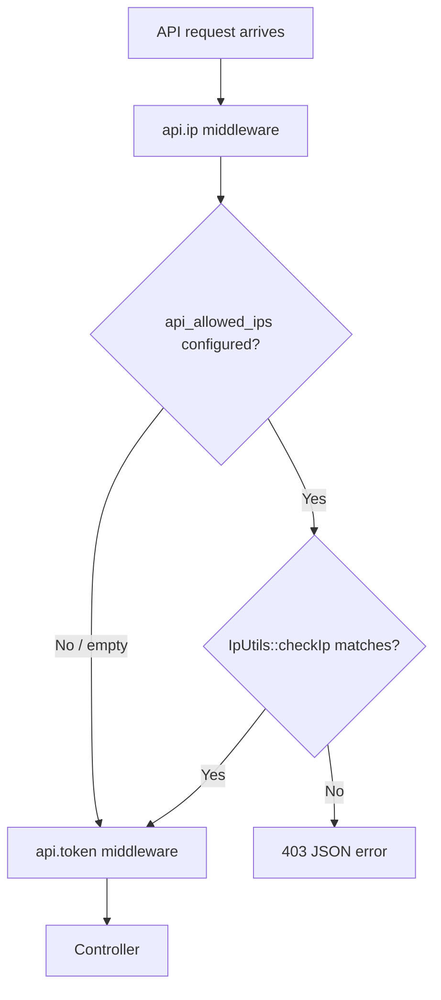

# REST API IP Allowlist — Implementation Plan

## Overview

Add an optional IP allowlist to the REST API. When configured, only requests coming from the listed IP addresses (or CIDR ranges) are allowed through. When the allowlist is empty, the API remains open to any IP, preserving current behavior.

- Stored as a single setting key: `api_allowed_ips`
- Managed from **Settings → RestAPI** tab via a multiline text box
- Supports IPv4 and IPv6, single addresses and CIDR notation, one entry per line
- Enforced by a new middleware on the existing API routes

---

## Behavior

| Allowlist value | Result |
|---|---|
| Empty / whitespace only | Any IP is allowed (current behavior) |
| One or more valid entries | Only matching IPs are allowed |
| Non-matching IP | `403` JSON response |
| Invalid entry in settings form | Validation error on save; invalid entries are rejected |

### Examples shown above the settings text box

```
203.0.113.10
203.0.113.0/24
2001:db8::1
2001:db8::/48
```

---

## Architecture



---

## Files to change

### 1. New — [`app/Support/IpWhitelist.php`](app/Support/IpWhitelist.php)

A small support class to keep parsing, validation, and matching logic DRY between the settings controller and the middleware.

```php
<?php

namespace App\Support;

use Symfony\Component\HttpFoundation\IpUtils;

class IpWhitelist
{
    /**
     * Parse a multiline allowlist into a clean array of entries.
     * One entry per line; whitespace and empty lines are ignored; duplicates removed.
     */
    public static function normalize(?string $raw): array
    {
        $entries = [];

        foreach (preg_split('/\r\n|\r|\n/', (string) $raw) ?: [] as $line) {
            $entry = trim($line);

            if ($entry === '') {
                continue;
            }

            $entries[] = $entry;
        }

        return array_values(array_unique($entries));
    }

    /**
     * Validate a single entry as a plain IPv4/IPv6 address or an IPv4/IPv6 CIDR range.
     */
    public static function isValidEntry(string $entry): bool
    {
        if (filter_var($entry, FILTER_VALIDATE_IP)) {
            return true;
        }

        if (! str_contains($entry, '/')) {
            return false;
        }

        [$ip, $mask] = explode('/', $entry, 2);

        if (! filter_var($ip, FILTER_VALIDATE_IP)) {
            return false;
        }

        if (! ctype_digit($mask)) {
            return false;
        }

        $maxBits = str_contains($ip, ':') ? 128 : 32;

        return (int) $mask >= 0 && (int) $mask <= $maxBits;
    }

    /**
     * Determine whether an IP is allowed by the given raw allowlist.
     * An empty allowlist allows any IP.
     */
    public static function isAllowed(string $ip, ?string $raw): bool
    {
        $entries = self::normalize($raw);

        if ($entries === []) {
            return true;
        }

        foreach ($entries as $entry) {
            if (IpUtils::checkIp($ip, $entry)) {
                return true;
            }
        }

        return false;
    }
}
```

`IpUtils::checkIp()` comes from Symfony HttpFoundation, already bundled with Laravel 11, and handles plain IPv4/IPv6 comparison as well as CIDR ranges for both families.

### 2. New — [`app/Http/Middleware/ApiIpWhitelist.php`](app/Http/Middleware/ApiIpWhitelist.php)

```php
<?php

namespace App\Http\Middleware;

use App\Models\Setting;
use App\Support\IpWhitelist;
use Closure;
use Illuminate\Http\Request;
use Symfony\Component\HttpFoundation\Response;

class ApiIpWhitelist
{
    public function handle(Request $request, Closure $next): Response
    {
        $ip = $request->ip();
        $allowlist = Setting::get('api_allowed_ips');

        if (! IpWhitelist::isAllowed($ip, $allowlist)) {
            return response()->json([
                'error' => 'IP address is not allowed to access the API.',
            ], 403);
        }

        return $next($request);
    }
}
```

### 3. Register and apply middleware

- [`bootstrap/app.php`](bootstrap/app.php:19) — add alias:

```php
'api.ip' => \App\Http\Middleware\ApiIpWhitelist::class,
```

- [`routes/api.php`](routes/api.php:7) — apply IP check before token auth:

```php
Route::middleware(['api.ip', 'api.token'])->group(function () {
```

### 4. Settings controller

- [`app/Http/Controllers/Admin/SettingsController.php`](app/Http/Controllers/Admin/SettingsController.php:32) — pass the value to the view in `edit()`:

```php
'apiAllowedIps' => Setting::get('api_allowed_ips', ''),
```

- Add imports: `App\Support\IpWhitelist` and `Illuminate\Validation\ValidationException`.

- In `update()`:
  - Add validation rule inside `$validated`:

    ```php
    'api_allowed_ips' => ['nullable', 'string', 'max:10000'],
    ```

  - After validation, validate each parsed entry and persist:

    ```php
    $allowedIps = trim((string) ($validated['api_allowed_ips'] ?? ''));

    foreach (IpWhitelist::normalize($allowedIps) as $entry) {
        if (! IpWhitelist::isValidEntry($entry)) {
            throw ValidationException::withMessages([
                'api_allowed_ips' => [__('messages.settings_api_allowed_ips_invalid', ['ip' => $entry])],
            ]);
        }
    }

    if ($allowedIps !== '') {
        Setting::put('api_allowed_ips', $allowedIps);
    } else {
        Setting::forget('api_allowed_ips');
    }
    ```

  - The existing `Setting::flushCache()` call at the end makes the change effective immediately.

### 5. Settings view — RestAPI tab

- [`resources/views/admin/settings.blade.php`](resources/views/admin/settings.blade.php:313) — add a new field inside the RestAPI tab, after the API token section:

```blade
<div>
    <label class="block text-sm font-semibold text-copy mb-2">{{ __('messages.settings_api_allowed_ips') }}</label>
    <p class="text-xs text-muted mb-2">{{ __('messages.settings_api_allowed_ips_help') }}</p>
    <textarea name="api_allowed_ips" rows="6"
              class="w-full bg-input border border-input-border rounded px-3 py-2 text-sm text-copy font-mono"
              placeholder="203.0.113.10&#10;203.0.113.0/24&#10;2001:db8::1&#10;2001:db8::/48">{{ old('api_allowed_ips', $apiAllowedIps) }}</textarea>
</div>
```

### 6. Language strings

Add to all three locale files:

- [`lang/en_US/messages.php`](lang/en_US/messages.php:140)
- [`lang/pt_BR/messages.php`](lang/pt_BR/messages.php:140)
- [`lang/es_MX/messages.php`](lang/es_MX/messages.php:140)

```php
'settings_api_allowed_ips'          => 'Allowed IP addresses',
'settings_api_allowed_ips_help'     => 'Restrict API access to specific IPs. Leave empty to allow any IP. One address per line. Supports IPv4 and IPv6, single addresses or CIDR ranges. Examples: 203.0.113.10, 203.0.113.0/24, 2001:db8::1, 2001:db8::/48.',
'settings_api_allowed_ips_invalid'  => 'Invalid IP address or CIDR range: :ip.',
```

Portuguese (`pt_BR`):

```php
'settings_api_allowed_ips'          => 'Endereços IP permitidos',
'settings_api_allowed_ips_help'     => 'Restrinja o acesso à API a IPs específicos. Deixe vazio para permitir qualquer IP. Um endereço por linha. Aceita IPv4 e IPv6, endereços únicos ou faixas CIDR. Exemplos: 203.0.113.10, 203.0.113.0/24, 2001:db8::1, 2001:db8::/48.',
'settings_api_allowed_ips_invalid'  => 'Endereço IP ou faixa CIDR inválido: :ip.',
```

Spanish (`es_MX`):

```php
'settings_api_allowed_ips'          => 'Direcciones IP permitidas',
'settings_api_allowed_ips_help'     => 'Restringe el acceso a la API a IPs específicas. Deja vacío para permitir cualquier IP. Una dirección por línea. Acepta IPv4 e IPv6, direcciones únicas o rangos CIDR. Ejemplos: 203.0.113.10, 203.0.113.0/24, 2001:db8::1, 2001:db8::/48.',
'settings_api_allowed_ips_invalid'  => 'Dirección IP o rango CIDR inválido: :ip.',
```

### 7. Documentation — [`API.md`](API.md:28)

- Add an **IP Address Allowlist** subsection under Authentication:

  - Default: empty = any IP allowed
  - Configured in **Settings → RestAPI**
  - One address per line; supports IPv4/IPv6, single addresses and CIDR
  - Example values

- Add `403` to the [Error Responses](API.md:339) table:

```json
{"error": "IP address is not allowed to access the API."}
```

---

## Validation summary

| Input | Stored? | Runtime behavior |
|---|---|---|
| `203.0.113.10` | Yes | Exact IPv4 match |
| `203.0.113.0/24` | Yes | IPv4 CIDR range |
| `2001:db8::1` | Yes | Exact IPv6 match |
| `2001:db8::/48` | Yes | IPv6 CIDR range |
| `999.1.1.1` | No — validation error | — |
| `203.0.113.0/99` | No — validation error | — |
| Empty | `api_allowed_ips` removed | Any IP allowed |

---

## Out of scope

- No database migration required (`settings` table is key/value)
- No new Composer dependencies
- No changes to token authentication logic
- No wildcard or hostname matching (only IP and CIDR)
