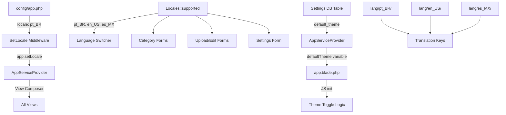

# Plan: Locale Normalization + Theme Setting

## Overview

Two interdependent changes:

1. **Locale key normalization** — rename locale keys from `en`/`es` to `en_US`/`es_MX`, reorder everything to `pt_BR` → `en_US` → `es_MX`
2. **Default theme setting** — add a server-side `default_theme` setting (dark/light) that controls the initial theme, replacing the hardcoded `class="dark"`

---

## Architecture Diagram



## Detailed Changes

---

### Phase 1: Rename Lang Folders & Files

| Old Path | New Path |
|---|---|
| `lang/en/messages.php` | `lang/en_US/messages.php` |
| `lang/es/messages.php` | `lang/es_MX/messages.php` |
| `lang/pt_BR/messages.php` | *(unchanged)* |

Each messages.php keeps all existing keys, plus new theme-related keys (see Phase 2).

---

### Phase 2: New Translation Keys (all 3 lang files)

Add these keys to `settings` section:

| Key | en_US | pt_BR | es_MX |
|---|---|---|---|
| `settings_default_theme` | Default theme | Tema padrão | Tema predeterminado |
| `theme_dark` | Dark | Escuro | Oscuro |
| `theme_light` | Light | Claro | Claro |
| `theme_system` | System preference | Preferência do sistema | Preferencia del sistema |

---

### Phase 3: `app/Support/Locales.php`

```php
// OLD order & keys
'en'    => ['name' => 'en_US', 'flag' => 'us'],
'es'    => ['name' => 'es_MX', 'flag' => 'mx'],
'pt_BR' => ['name' => 'pt_BR', 'flag' => 'br'],

// NEW order & keys
'pt_BR' => ['name' => 'pt_BR', 'flag' => 'br'],
'en_US' => ['name' => 'en_US', 'flag' => 'us'],
'es_MX' => ['name' => 'es_MX', 'flag' => 'mx'],
```

---

### Phase 4: `config/app.php`

```php
// OLD
'locale' => 'en',
'fallback_locale' => 'en',

// NEW
'locale' => 'pt_BR',
'fallback_locale' => 'pt_BR',
```

---

### Phase 5: Database Migration (new file)

**File**: `database/migrations/2026_08_05_000001_rename_locale_columns.php`

**Categories table**:
- `name_en` → `name_en_US`
- `name_es` → `name_es_MX`

**Images table**:
- `headline_en` → `headline_en_US`
- `headline_es` → `headline_es_MX`
- `description_en` → `description_en_US`
- `description_es` → `description_es_MX`
- Drop old fulltext indexes, recreate with new column names

---

### Phase 6: Model Updates

#### `app/Models/Category.php`
```php
// OLD
protected $fillable = ['handle', 'name_en', 'name_es', 'name_pt_BR'];

// NEW
protected $fillable = ['handle', 'name_en_US', 'name_es_MX', 'name_pt_BR'];
```

`getName()` fallback chain — change all `'es'` → `'es_MX'`, `'en'` → `'en_US'`, and adjust the fallback array of column names:
```php
// OLD fallback column array
['name_en', 'name_es', 'name_pt_BR']

// NEW
['name_en_US', 'name_es_MX', 'name_pt_BR']
```

#### `app/Models/Image.php`
```php
// OLD fillable
'headline_en', 'headline_es', 'headline_pt_BR',
'description_en', 'description_es', 'description_pt_BR',

// NEW fillable
'headline_en_US', 'headline_es_MX', 'headline_pt_BR',
'description_en_US', 'description_es_MX', 'description_pt_BR',
```

`getLocalizedField()` — change `'es'` → `'es_MX'`, `'en'` → `'en_US'` in the fallback chain conditions.

---

### Phase 7: Controller Updates

#### `app/Http/Controllers/Admin/CategoryController.php`
All references to `name_en` and `name_es` become `name_en_US` and `name_es_MX`:
- Validation rules
- `Category::create()` call
- `category->update()` call
- Empty-check condition for "at least one name"

#### `app/Http/Controllers/Admin/SettingsController.php`
Add to `edit()`:
```php
'defaultTheme' => Setting::get('default_theme', 'dark'),
```

Add to `update()` validation:
```php
'default_theme' => ['required', 'string', 'in:dark,light'],
```

Add save logic:
```php
Setting::put('default_theme', $validated['default_theme']);
```

#### `app/Http/Controllers/HomeController.php`
Search query columns:
```php
// OLD
->orWhere('description_en', 'like', '%'.$q.'%')
->orWhere('description_es', 'like', '%'.$q.'%')

// NEW
->orWhere('description_en_US', 'like', '%'.$q.'%')
->orWhere('description_es_MX', 'like', '%'.$q.'%')
```
Also `headline_en` → `headline_en_US`, `headline_es` → `headline_es_MX`.

#### `app/Http/Controllers/Admin/TranslateController.php`
Validation:
```php
// OLD
'in:en,es,pt_BR'

// NEW
'in:en_US,es_MX,pt_BR'
```

Locale names map:
```php
// OLD
'en'    => 'English',
'es'    => 'Spanish (Mexican)',

// NEW
'en_US' => 'English',
'es_MX' => 'Spanish (Mexican)',
```

---

### Phase 8: View Updates

#### `resources/views/layouts/app.blade.php`
1. Remove hardcoded `class="dark"` from `<html>` tag (line 2)
2. Add `$defaultTheme` to the JS theme init block:
```js
const defaultTheme = @json($defaultTheme ?? 'dark');
const stored = localStorage.getItem('theme');
const prefersDark = window.matchMedia('(prefers-color-scheme: dark)').matches;
// Priority: localStorage > server default > system preference
let dark;
if (stored) {
    dark = stored === 'dark';
} else if (defaultTheme) {
    dark = defaultTheme === 'dark';
} else {
    dark = prefersDark;
}
setTheme(dark);
```

#### `resources/views/admin/settings.blade.php`
Add a new section between "Default language" and "Posts per page" (after line 65):
```blade
{{-- Default theme --}}
<div>
    <label class="block text-sm text-muted mb-1">{{ __('messages.settings_default_theme') }}</label>
    <select name="default_theme"
            class="bg-input border border-input-border rounded px-3 py-2 text-sm text-copy">
        <option value="dark" @selected($defaultTheme === 'dark')>{{ __('messages.theme_dark') }}</option>
        <option value="light" @selected($defaultTheme === 'light')>{{ __('messages.theme_light') }}</option>
    </select>
</div>
```

#### Other views
- `categories.blade.php` — dynamically generates column names from `Locales::supported()` keys, so `str_replace('_', '_', $code)` will automatically produce `name_en_US` and `name_es_MX` ✅
- `upload.blade.php` — same dynamic pattern ✅
- `edit.blade.php` — same dynamic pattern ✅
- `search.blade.php` — no hardcoded locale references ✅

---

### Phase 9: `app/Providers/AppServiceProvider.php`

Add to the view composer:
```php
'defaultTheme' => $this->safeSetting('default_theme') ?: 'dark',
```

---

## File Change Summary

| File | Action |
|---|---|
| `lang/en/messages.php` | Move to `lang/en_US/messages.php` + add theme keys |
| `lang/es/messages.php` | Move to `lang/es_MX/messages.php` + add theme keys |
| `lang/pt_BR/messages.php` | Add theme keys |
| `app/Support/Locales.php` | Reorder + rename keys |
| `config/app.php` | Change locale/fallback to pt_BR |
| `database/migrations/2026_08_05_000001_rename_locale_columns.php` | **NEW** — rename DB columns |
| `app/Models/Category.php` | Update fillable + fallback chain |
| `app/Models/Image.php` | Update fillable + fallback chain |
| `app/Http/Controllers/Admin/CategoryController.php` | Update column refs |
| `app/Http/Controllers/Admin/SettingsController.php` | Add default_theme |
| `app/Http/Controllers/HomeController.php` | Update search columns |
| `app/Http/Controllers/Admin/TranslateController.php` | Update locale validation + names |
| `app/Providers/AppServiceProvider.php` | Add defaultTheme to composer |
| `resources/views/admin/settings.blade.php` | Add theme selector |
| `resources/views/layouts/app.blade.php` | Remove hardcoded dark, update JS |
