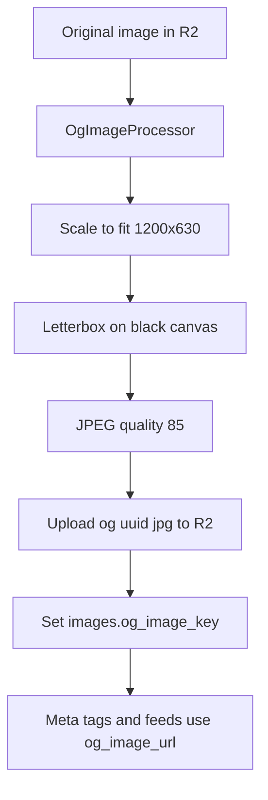

# OpenGraph / Feed Thumbnail Generation Plan

## Goal

Generate a single 1200x630 (1.91:1) JPEG thumbnail per post for social sharing and
feed consumers, while keeping the original full-size image for the website.

## Decisions (confirmed)

| Topic | Decision |
| ----- | -------- |
| Target size | 1200 x 630 px |
| Aspect ratio | 1.91:1 OpenGraph ratio |
| Output format | JPEG, quality 85 |
| Letterbox background | Solid black |
| Reuse | Same file for `og:image`, `twitter:image`, RSS, Atom, and JSON Feed |
| Website image | Keep the original full-size image |
| Backfill | Runs directly inside the migration |

## R2 key layout

- Original: `images/{uuid}.{ext}` (unchanged)
- OG thumbnail: `og/{uuid}.jpg`

The `images` table gains a nullable `og_image_key` column. The column is only set
when generation succeeds, so views can safely fall back to the original URL.

## Generation algorithm

1. Read the original bytes from R2 using the stored `r2_key`.
2. Decode with GD using the stored `mime_type` (jpeg, png, webp, gif, avif).
3. Compute a center-crop-free scale-to-fit of the source into 1200x630 while
   preserving the aspect ratio.
4. Create a 1200x630 truecolor canvas filled with black.
5. Copy the resampled source centered onto the canvas.
6. Encode as JPEG quality 85.
7. Upload to R2 at `og/{uuid}.jpg` with public visibility and
   `Content-Type: image/jpeg`.
8. Update `images.og_image_key` on success; leave null and log on failure.

## Fallback behavior

- `Image::og_image_url` accessor returns the OG thumbnail URL when
  `og_image_key` is set, otherwise the original `public_url`.
- Meta tags and feeds always use `og_image_url`.
- The post detail page `` and JSON-LD `contentUrl` keep the original image.

## Files touched

- `app/Support/OgImageProcessor.php` (new)
- `app/Console/Commands/GenerateOgImages.php` (new)
- `app/Models/Image.php`
- `app/Http/Controllers/Admin/UploadController.php`
- `app/Http/Controllers/Api/PostController.php`
- `app/Http/Controllers/FeedController.php`
- `resources/views/image/show.blade.php`
- `database/migrations/*_add_og_image_key_to_images_table.php` (new, includes backfill)

## Migration behavior

The migration performs two steps:

1. Schema: add `og_image_key` nullable string column after `r2_key`.
2. Backfill: iterate all images in chunks, generate each thumbnail, and set
   `og_image_key` when successful.

Important notes:

- Backfill runs inside `php artisan migrate` and may take a long time for large
  catalogs because each post requires an R2 download, GD processing, and an R2 upload.
- The migration prints `[done/total]` progress lines to the console so progress is
  visible in Docker Compose logs.
- `$withinTransaction = false` keeps each image update committed independently, so an
  interrupted run does not roll back work already completed.
- The schema change is idempotent, so an interrupted migration can be resumed safely by
  running `php artisan migrate` again; remaining rows are picked up via `whereNull`.
- Each image is processed in its own try/catch so one failure does not abort the
  migration; failures are logged and left with a null `og_image_key`.
- If GD is unavailable, processing is skipped and the column remains null.
- The equivalent manual command is `php artisan images:generate-og` (`--fresh` to
  regenerate all posts).

## Upload and update integration

- New uploads generate the thumbnail after the image record is created.
- Image replacement on update deletes the old thumbnail object, generates a new one,
  and updates `og_image_key`.
- Post deletion removes both the original and thumbnail R2 objects.

## Meta tag output

Post page (`image/show.blade.php`):

```html
<meta property="og:image" content="{og_image_url}">
<meta property="og:image:width" content="1200">
<meta property="og:image:height" content="630">
<meta name="twitter:image" content="{og_image_url}">
```

## Feed integration

- Atom: replace the embedded `` with the OG thumbnail URL.
- RSS: replace the embedded `` with the OG thumbnail URL.
- JSON Feed: add the top-level item `image` field with the OG thumbnail URL and use
  it in `content_html`.

## Flow


