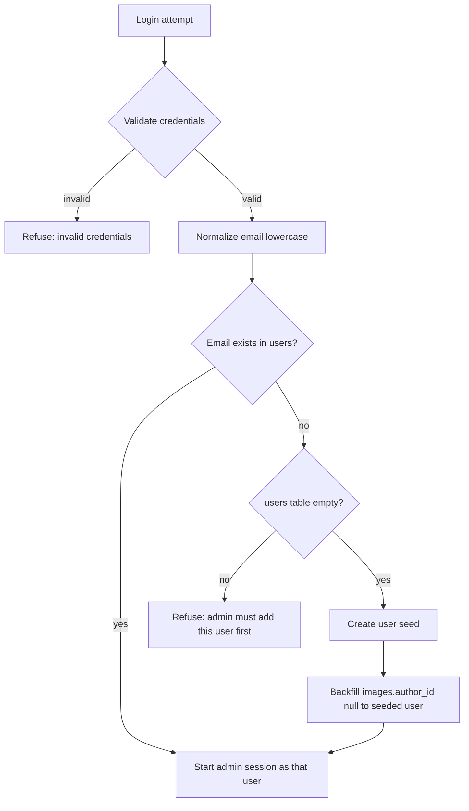

# Users, Authors & Auth Overhaul

## Goal

Replace the single-admin auth model with a multi-user, email-based author model:

- Remove `AUTH_METHOD=none` entirely.
- Introduce a `users` table (email + display name) managed from a new **Users** tab in Settings.
- `ACCOUNT_LOGIN`/`ACCOUNT_PASSWORD` become comma-separated, index-aligned email/password lists.
- `KEYCLOAK_EMAIL_ACCOUNT` becomes a comma-separated allowlist of full emails and bare domains.
- reCAPTCHA is required/supported on the account login (keys via `.env`).
- First login seeds the Users list and backfills existing posts with the first user as author.
- Subsequent logins (account + keycloak) are refused unless the email already exists in Users.
- Posts can optionally display author + published date/time (+ updated date/time when modified), including in social meta/share text.

## Design decisions

- Default auth method when `AUTH_METHOD` is unset or invalid: **account**.
- `ACCOUNT_LOGIN` and `ACCOUNT_PASSWORD` are comma-separated lists paired by index.
  Example: `ACCOUNT_LOGIN='a@x.com,b@y.com'`, `ACCOUNT_PASSWORD='hash1,hash2'`.
- `KEYCLOAK_EMAIL_ACCOUNT` entries are either a full email (exact, case-insensitive match)
  or a bare domain (`example.com` matches any `*@example.com`). No Keycloak group-claim
  matching is implemented.
- New `users` table columns: `id`, `email` (unique, stored lowercase), `display_name`
  (nullable), `timestamps`.
- New `images.author_id` nullable unsigned big integer FK -> `users.id`, indexed.
- Author display name resolution: `display_name` if non-empty, otherwise `email`.
- "First login" = `users` table is empty at login time. In that case the authenticated
  user is created and all posts with `author_id IS NULL` are assigned to them.
- Non-first logins require the email to already exist in `users`; otherwise login is
  refused with an admin-must-add-user message.

## Login flow (account & keycloak)

## File changes

### Database
- `database/migrations/XXXX_create_users_table.php` — create `users`.
- `database/migrations/XXXX_add_author_to_images_table.php` — add `images.author_id`
  FK + index; optionally backfill in a later data step (seeding handles backfill).

### Models
- `app/Models/User.php` — new model; `displayName()` returns `display_name ?: email`.
- `app/Models/Image.php` — add `author_id` to fillable; add `author()` BelongsTo.

### Auth config & support
- `config/auth_method.php` — remove `none`; default `account`; parse lists into arrays;
  keep recaptcha keys.
- `app/Auth/AuthMethodResolver.php` — remove `NONE`/`isNone()`; `current()` defaults to
  `account`; update `loginUrl()`.
- `app/Support/UserAuthorizer.php` — new service: normalize email, find/create/seed,
  enforce allowlist, backfill posts, resolve author id from session.

### Auth controllers
- `app/Http/Controllers/Auth/AccountAuthController.php` — email field, multi-user
  credential check, recaptcha, seed/backfill, allowlist refusal, session email + user id.
- `app/Http/Controllers/Auth/KeycloakAuthController.php` — email/domain allowlist,
  seed/backfill, allowlist refusal, session email + user id.

### Middleware
- `app/Http/Middleware/EnsureAdmin.php` — remove `none` abort path.

### Admin settings (Users tab)
- `app/Http/Controllers/Admin/SettingsController.php` — pass users + display settings;
  persist users via inline arrays and author/date display settings.
- `resources/views/admin/settings.blade.php` — add Users tab (list + add/change email
  and display name + remove), add "show author / published date" options in Appearance.

### Post authoring & display
- `app/Http/Controllers/Admin/UploadController.php` — set `author_id` on store/update
  from session user.
- `app/Http/Controllers/Api/PostController.php` — include author, published_at,
  updated_at in `formatPost()`.
- `resources/views/image/show.blade.php` + `resources/views/home.blade.php` — render
  author + published/updated dates when enabled.
- `resources/views/image/show.blade.php` — add `og:article:author`,
  `og:article:published_time`, `og:article:modified_time`, twitter equivalents, and
  include author/date in share intent text.

### Feeds
- `app/Http/Controllers/FeedController.php` — add author and modified timestamps to
  Atom/RSS/JSON items.

### Config & translations
- `docker/.env` — document new vars; remove `AUTH_METHOD=none` docs.
- `lang/en_US/messages.php`, `lang/pt_BR/messages.php`, `lang/es_MX/messages.php` —
  new keys for Users tab, author/date labels, login refusal, email field, etc.

## Notes

- `created_at` is used as "published date/time"; `updated_at` as "updated at".
- API-created posts have no session author, so `author_id` stays null there.
